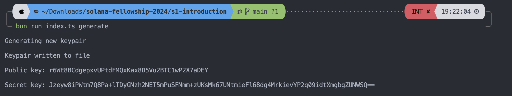
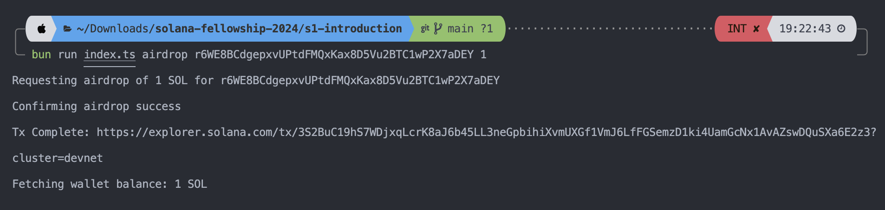
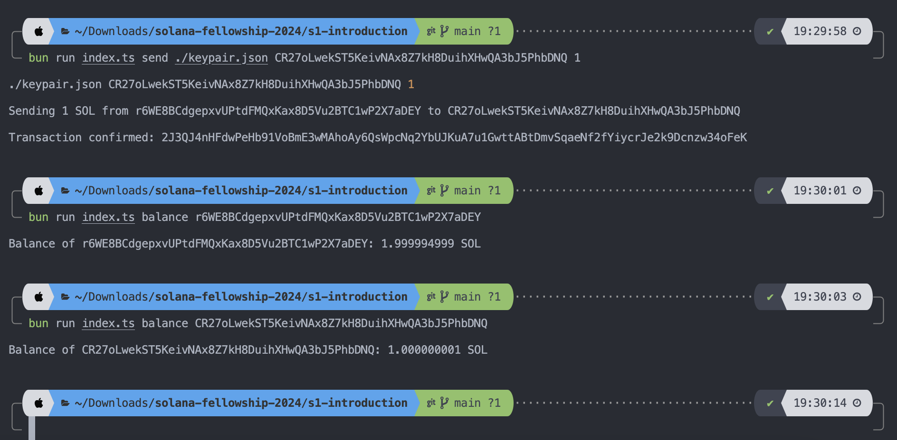
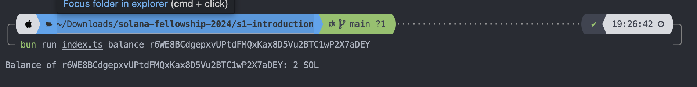

# s1-introduction

Task: Build a cli wallet that generates a keypair and can handle airdrop/sending sol

## Features

1. A command to generate new wallet
2. getting airdrop from network
3. sending network token to another address
4. [additional] a command to check balance

## To run the project

Note: You need to have solana-test-validator running in the background to prevent errors.
Personally, I faced issues getting `Server responded with 429 Too Many Requests. Retrying after 500ms delay...` and found a work around by running a local network.

### Set up the local validator

In the cli:

```
   solana-test-validator
```

### Run the project

```
  bun run index.ts <feature>
```

### Features

1. Generate a new wallet: A command to generate a new wallet, and the keypair will be saved locally in the project directory as `keypair.json`.

```
  bun run index.ts generate
```



2. Get airdrop

```
  bun run index.ts airdrop <address> <amount>
```



3. Send sol to another address

```
  bun run index.ts send <keypath.json file path> <recipient_address> <amount>
```



4. Check balance

```
  bun run index.ts balance <address>
```



## Appendix

Some addresses to play with:

- r6WE8BCdgepxvUPtdFMQxKax8D5Vu2BTC1wP2X7aDEY
- CwYWgGFgrrdX4qFTPK9SoiWPpt49AjUiCH89FiEASEUS

## Suggested user flow

1. Generate a new wallet A
2. Get airdrop for wallet A (save the address somewhere for reference in terminal later)
3. Generate a new wallet B
4. Get airdrop for wallet B (wallet B keypair will be saved on the project directory)
5. Check balance of wallet A and B
6. Send sol from wallet A to wallet B
7. Check balance of wallet B
