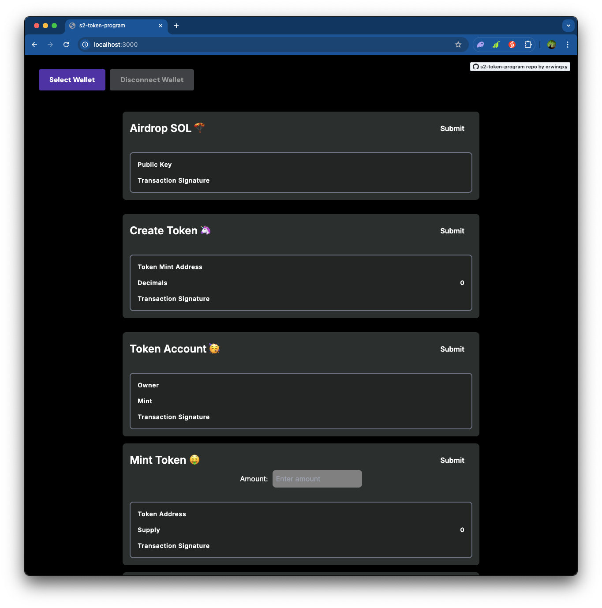

# s2-token-program

Build a web UI that can handle creation of a token, it's mint, transfer of that token, burning the token supply, and delegation the ata of this token to another public key. [Watch a quick demo here!](https://www.youtube.com/watch?v=9hHeW2GCR9w)



## Getting Started

First, install the relevant packages:

```bash
npm run dev
```

Then, run the development server:

```bash
npm run dev
# or
yarn dev
# or
pnpm dev
# or
bun dev
```

Open [http://localhost:3000](http://localhost:3000) with your browser to see the result.

### [If needed] Set up the local validator

In the cli:

```bash
solana-test-validator
```

Update the solanaRpc in `wallet.ts`

```bash
const solanaRpc = 'https://api.devnet.solana.com';
# or
const solanaRpc = "http://127.0.0.1:8899"
```

## Tech Stack

- [Solana wallet adapter](https://github.com/anza-xyz/wallet-adapter/blob/master/APP.md)
- [Solana Cookbook Token docs](https://solanacookbook.com/references/token.html#what-do-i-need-to-get-started-with-spl-tokens)

## Lesson Learned

token program: the default program in the solana program library (maintained by solana labs team) for handling creation, supply & transfer of custom tokens [hence its called spl-token]

system program - only handle network tokens! handle lamports

decimals: at the time of creation: it specifies the smallest fragment of a token and can’t be changed later.

- the min decimal amount is 0, which is a non-fungible token
- the max (and default) decimal amount is 9

create: this instruction creates a new token on the token program

- supply can be increased by token creator or more public keys can authorize to do so
- each token has a unique mint address

mint/burn: increase or decrease the supply

- only the keys that are authroized to mint more tokens can mint (mint authority)
- anyone can burn minted token
- min authority of anyone can be revoked, even the token creator

transfer: transfer of tokens between associated token accounts of holders

- a token can only be held in an associated token account (ata), this token account is unique for each key particular to a token, and the holder of this account is authorized to perform actions on it
  - we dont send the token from one public address to another
  - need to have the associated token account
- when transferring tokens, the holder key authorizes the transaction and it gets transferred between accounts, if the receiving key doesn't have an ata, the sender's client has to create the ata

delegation: authorizing a different key to perform actions on an ata

- max transfer amount can be specified in a delegation instruction to ensure that the authroized key cant transfer any more
- delegations are risky

Transactions 
- They are atomic 
- Each instruction contains:
  - an array of accounts that will be read from and/or written to. This is what makes Solana fast - transactions that affect different accounts are processed simultaneously
  - the public key of the program to invoke 
  - data passed to the program being invoked, structured as a byte array

Building a transaction
- use `new Transaction().add({function})` to create a new transaction
- then use `await sendAndConfirmTransaction` to send the transaction to the network and wait for confirmation
- only then the transaction is considered complete / failed 
- the signature of the first transaction is considered the transaction id

```typescript
const transaction = new Transaction();
 
const sendSolInstruction = SystemProgram.transfer({
  fromPubkey: sender,
  toPubkey: recipient,
  lamports: LAMPORTS_PER_SOL * amount,
});
 
transaction.add(sendSolInstruction);

const signature = await web3.sendAndConfirmTransaction(
  connection,
  transaction,
  [payer],
);
 
console.log(`✅ Success! Transaction signature is: ${signature}`);
```

