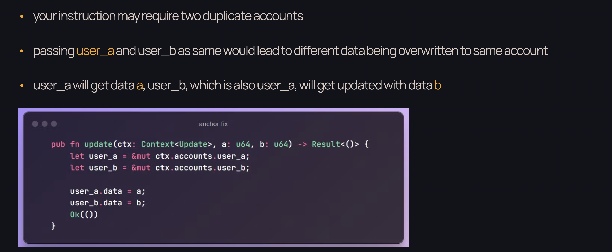

# s5-introduction-to-program-security 

## Common Problems 

### 1. integer arithmetic problems
  - rust do not always catch overflows 

| integer type | min value | max value |
| -------- | ------- |------- |
| u8 | 0 | 255 |
|u16 | 0 | 65,535|
| u32 | 0 | 4,294,967,295|
| i8 | -128 | 127|
| i16 | -32,768 | 32,767|
| i32 | -2,147,483,648 | 2,147,483,647|

fix: 
  - use `wrapping_add` and `wrapping_sub` methods
  - use `checked_add` and `checked_sub` methods
  - use `overflowing_add` and `overflowing_sub` methods
  - use `saturating_add` and `saturating_sub` methods

### 2. Missing Signer / Account Type Checks 

### 3. Re-initialization Attacks 

- attacker can re-initialize the contract and reset the state of the contract
- fix: 
  - use `is_initialized` flag to check if the contract is already initialized
  - use anchor `init` constraint that allows the contract to be initialized only once

### 4. Duplicate Mutable Accounts 

### 5. Unsafe CPI Calls

## Useful Resources 

- https://neodyme.io/en/blog/solana_common_pitfalls/
- https://www.halborn.com/blog/post/how-to-hack-solana-smart-contracts-programs 