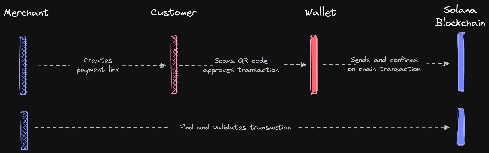
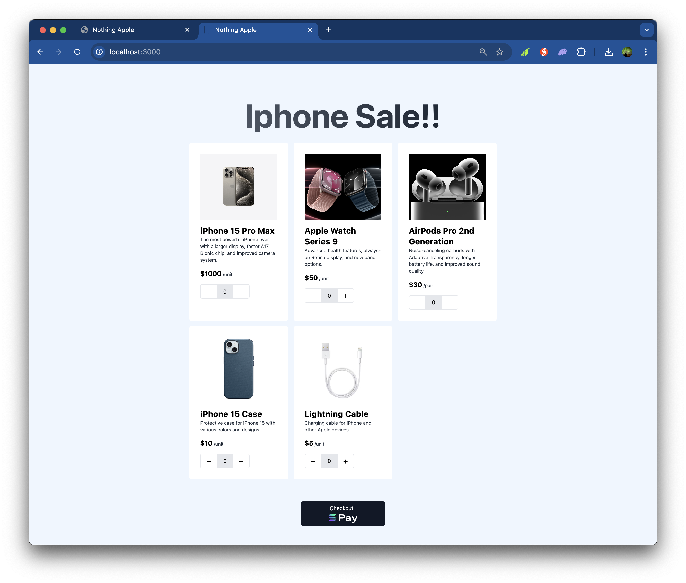
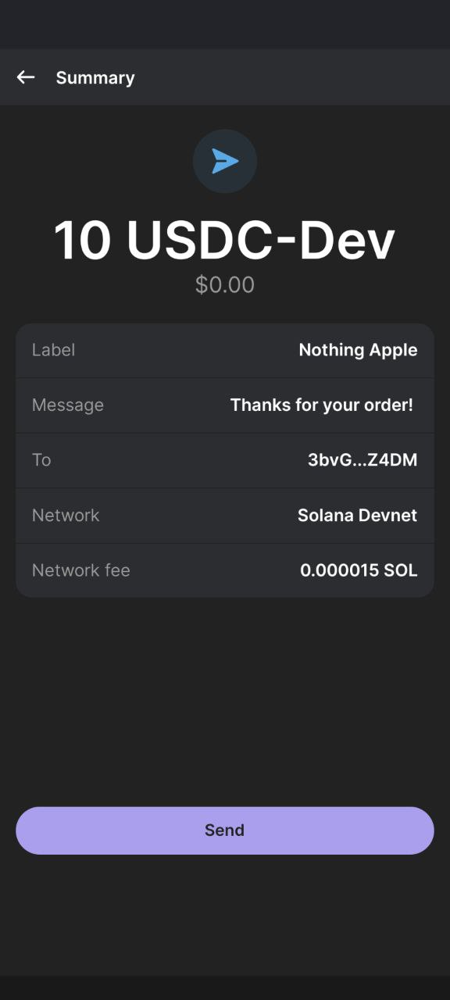

# s6-solana-pay

## Task

Build a Point-Of-Sale Web UI for adding products and checking out with Solana Pay. The payment confirmation should be displayed after checkout. 

## Demo 

Youtube video [here](https://www.youtube.com/watch?v=9Wenb5sl65g)

[](https://www.youtube.com/watch?v=9Wenb5sl65g)


## To Set Up

```bash
git clone git@github.com:erwinqxy/solana-fellowship-2024.git
cd solana-fellowship-2024/s6-solana-pay
yarn install
yarn dev
ngrok http 3000 # to expose the local server to the internet
```


## Concepts 

### How Solana Pay Works


The diagram above illustrates the process of a Solana Pay transaction between a client (user's wallet) and a server (merchant's website or application).

User Creates an Order: The user visits the merchant's website or application and selects the product or service they wish to purchase.
Merchant Creates a Payment Link: The website generates a Solana Pay transaction request URL, which may include payment links, "Pay Now" buttons, or QR codes.
User Scans and Approves Transaction: The transaction request URL is parsed by the user's wallet using the Solana Pay JavaScript library, which extracts the necessary parameters from the URL. The wallet send's the Solana transaction to the cluster for processing.
Server Finds and Validates the Transaction: The merchant's server verifies that the on-chain transaction details (such as amount, token, and recipient address) match the specified request. This process ensures that the payment is processed quickly, the transaction is secured by the Solana blockchain, and the merchant receives the correct payment amount. ([Reference](https://www.quicknode.com/guides/solana-development/solana-pay/getting-started-with-solana-pay))

## Pages 

### Landing Page



### Transaction Pages 



Example of the transaction compeleted: https://explorer.solana.com/tx/5V4rWNg6VoyMCsJ9txNfYMABXx6MWuGBZs98q27eXzjwPaR2TGHq5ygviGidNVm5zAZLfHf16XRwf27diWfK7u62?cluster=devnet 

## References 
- Good entry point:  https://github.com/pointer-gg/solana-pay-tutorial/tree/start
- Solana Pay: https://docs.solanapay.com/
