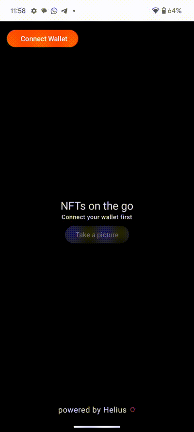
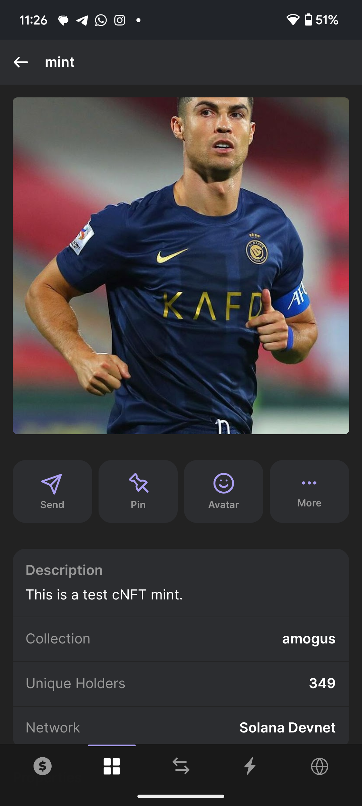
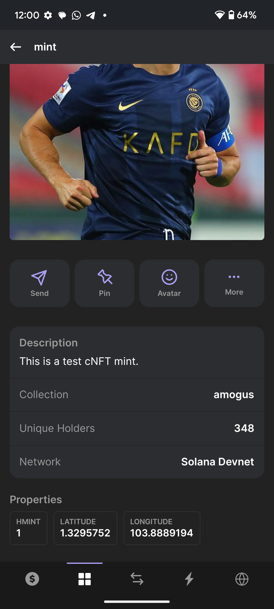

# s7-solana-mobile-dev

## Task 

Build an app that captures an image through the camera, mints an NFT with that image, and adds the current location longitude, latitude in the metadata.

## Implementation

As I wanted to focus on the solana technologies and not be overwhelmed by mobile app development, I did some research and came across a NFT mobile app tutorial by Helius. Detsils of the tutorial can be found [here](https://www.helius.dev/blog/build-a-cnft-minter-mobile-app-in-under-5-minutes).

### What are compressed NFTs?

Compressed NFTs (cNFTs) use state compression and concurrent Merkle trees to reduce storage costs. Compressed NFTs are 2,400-24,000x cheaper than their uncompressed counterparts, while still retaining identical structures.


## Demo 

Here is a demo of the app that was built. [Youtube Demo](https://www.youtube.com/embed/eUQxlx4phcQ)



## The NFT that was minted

Here are a few screenshots of the NFT that was minted on the solana devnet. Example of the transaction can be found [here](https://explorer.solana.com/tx/3kWTs3ks5BuHurx6iGEFSJsEfPo8SvAANT4SvphkigyAgePW1jS3APvhL4MXaGPZaXQrv5xeMWmsBti9XFYKBuEz?cluster=devnet).

Note how we are able to add details like:

- Name
- Description
- Properties like latitude and longitude

<div style="display: flex; justify-content: space-between;">

  
  

</div>


# How it works

In this mobile app, we are using Helius MINT API to mint the NFTs. The app captures an image through the camera, compresses it, and sends it to the Helius MINT API to mint the NFT. The app also captures the current location of the device and adds the longitude and latitude to the metadata of the NFT.

Here is the function in MainAcitivty.kt that sends the image to the Helius MINT API to mint the NFT.

```kotlin
fun mintCNft(imageUri: Uri, nftName: String, user: String, latitude: Double, longitude: Double) =
        viewModelScope.launch {
            _state.update {
                _state.value.copy(
                    isLoading = true,
                )
            }

            withContext(viewModelScope.coroutineContext + Dispatchers.IO) {
                val apiKey = System.getProperty("api_key") ?: ""
                val url = URL("https://devnet.helius-rpc.com/?api-key=$apikey")
                val mediaType = "application/json".toMediaTypeOrNull()
                val requestBody = """
                    {
                        "jsonrpc": "2.0",
                        "id": "helius-test",
                        "method": "mintCompressedNft",
                        "params": {
                                    "name": "$nftName",
                                    "symbol": "EQ",
                                    "owner": "$user",
                                    "description": "This is a test cNFT mint.",
                                    "attributes": [
                                        {
                                            "trait_type": "hMint",
                                            "value": "1"
                                        },
                                        {
                                            "trait_type": "latitude",
                                            "value": "$latitude"
                                        },
                                        {
                                            "trait_type": "longitude",
                                            "value": "$longitude"
                                        }
                                                                                                
                                    ],
                                    "imageUrl": "$imageUri",
                                    "sellerFeeBasisPoints": 6900
                                    }
                    }
                    """.trimIndent()

                val body = requestBody.toRequestBody(mediaType)
                val request = Request.Builder()
                    .url(url)
                    .post(body)
                    .addHeader("accept", "application/json")
                    .addHeader("content-type", "application/json")
                    .build()
                val client = OkHttpClient()

                client.newCall(request).enqueue(object : Callback {
                    override fun onFailure(call: Call, e: IOException) {
                        // Handle failure
                        e.printStackTrace()
                        Log.d(TAG, "NFT Mint Failed")
                        _state.update {
                            _state.value.copy(
                                isLoading = false,
                                mintResponse = "Mint Failed"
                            )
                        }
                    }

                    override fun onResponse(call: Call, response: Response) {
                        if (response.isSuccessful) {
                            val responseBody = response.body?.string() ?: ""
                            val gson = Gson()
                            val nft = gson.fromJson(responseBody, NftMintResponse::class.java)
                            Log.d(TAG, "NFT Mint Successful: $nft")
                            _state.update {
                                _state.value.copy(
                                    isLoading = false,
                                    mintResponse = "Minted Successfully"
                                )
                            }

                        } else {
                            // Handle non-successful response
                            Log.d(TAG, "NFT Mint Failed: ${response.code}")
                            _state.update {
                                _state.value.copy(
                                    isLoading = false,
                                    mintResponse = "Minted Failed"
                                )
                            }
                        }
                    }
                })
            }
        }
```

## Setting up the project

1. Clone the repository
2. Create a new account to get the API key from [Helius](https://dashboard.helius.dev/signup?redirectTo=onboarding)
3. Update the API key in `s7-solana-mobile-dev/app/src/main/java/com/example/hmint/MainActivity.kt`
4. Run the app on an emulator or a physical device
5. Grant the app permission to access the camera and location
6. Connect your wallet
7. Capture an image and mint the NFT
8. Check the minted NFT on the solana devnet