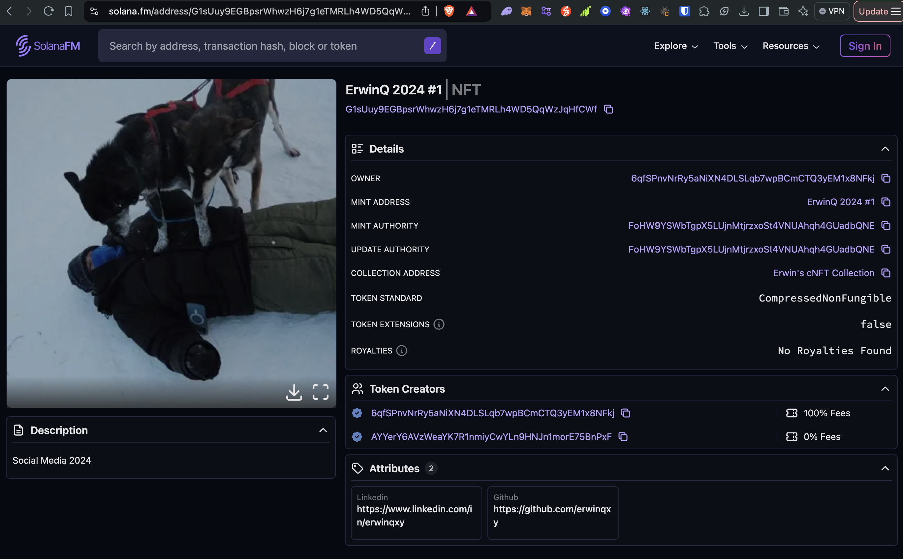

# s8-cnft

## Task

Create a cNFT collection of your own profile picture and social links as metadata and airdrop it to other fellows.

## Implementation 

I refered to Solana's documentation on [Creating Compressed NFTs with JavaScript](https://solana.com/developers/guides/javascript/compressed-nfts) for this exercise. During which, I learned how to create a compressed NFT collection and mint compressed NFTs to different addresses. I had an issue with the metadata not being rendered correctly on the scanner. However, I discovered the issue and found a workaround by using [Pinata](https://pinata.cloud/) to host the metadata.

I created a compressed NFT collection of my profile picture and social links (github and linked) as metadata. See on [SolanaFm](https://solana.fm/address/G1sUuy9EGBpsrWhwzH6j7g1eTMRLh4WD5QqWzJqHfCWf/transactions?cluster=devnet-alpha)



## To Setup

1. Clone this repo to your local system
2. Install the packages via `yarn install`
3. Rename the example.env file to be named .env
4. Update the `RPC_URL` variable to be the cluster URL of a supporting RPC provider 
5. Modify the relevant metadata details with the NFT you want to create in the metadata folder
6. Upload the metadata to IPFS and copy the relevant links and update the uri in `createAndMint.ts` file

## To Run

Running the included Scripts
Once you're setup locally, you will be able to run the scripts included within this repo:

```bash
yarn demo ./scripts/<script>
```

## Scripts Available

`scripts/createAndMint.ts`

Performs all the following actions:

- create a new Merkle tree on-chain
- create a new NFT collection
- mint two compressed NFTs (to different addresses)

`scripts/fetchNFTsByOwner.ts`

Uses the ReadApi fetchAssetsByOwner method to fetch the NFTs owners by the two addresses.

`scripts/transferNFT.ts`

Performs the complete process to transfer compressed NFTs. Specifically:

- fetching the NFT asset data from the RPC
- fetching the asset's proof from the RPC
- verifying the RPC provided proof on the client side
- builds the compressed NFT transfer function

## Example Outputs 

Can be found in the `outputs` folder

Example:

```bash

yarn demo ./scripts/createAndMint.ts                                                                                                                                   ─╯
yarn run v1.22.22
$ npx ts-node -r tsconfig-paths/register ./scripts/createAndMint.ts
Payer address: 6qfSPnvNrRy5aNiXN4DLSLqb7wpBCmCTQ3yEM1x8NFkj
Test wallet address: AYYerY6AVzWeaYK7R1nmiyCwYLn9HNJn1morE75BnPxF
Starting account balance: 2.00 SOL

Space to allocate: 64,504.00 bytes
Estimated cost to allocate space: 0.4498387200
Max compressed NFTs for tree: 16,384.00

===============================================
===============================================

Creating a new Merkle tree...
treeAddress: EVQRSVjCC6PHt8N1LQgX6h41448fAp5KuzvwxLWHhHZP
treeAuthority: 7rF3EPsTRgqfjxKZunv3qwhkXL1X4WmWq3bu9cVoVSrY

Merkle tree created successfully!
<https://explorer.solana.com/tx/4m6t3CT5wtPR4rBjYk3yTYMBuD9iVo99yG6RgYK3u1NNx7SEfAjEPihukeu62dzF1RmXzbCYXGFx48ZX2AaA8a6x?cluster=devnet>

Creating the collection's mint...
Mint address: 6JZguruV1SadU5J2iytgmrDGZTkr2awxBeHyakuzwvxD
Creating a token account...
Token account: 25h48rSHznCe6ghAkKZs4Qw1aDv6234k6RKj8CmaQoZh
Minting 1 token for the collection...
Metadata account: BxTTHjGBCVTUi3U8E1EyqDk27R1oEbpJMfTLPjyFNBJ8
Master edition account: 72vHjQQZu12M9CtW6BekdXAvm52kXbMzWPpwbVmJf8kq

Collection successfully created!
<https://explorer.solana.com/tx/3K68QsLmMem5NHsTEKcuyumrSN2itVeMxuLPFhcddn897nuFJWibrCzzSGoCf9BYWLNGMYAhV6i9hrfDvJXYEroy?cluster=devnet>

Minting a single compressed NFT to 6qfSPnvNrRy5aNiXN4DLSLqb7wpBCmCTQ3yEM1x8NFkj...
computedDataHash: 8JYPdpwQkXrbMA6Ns7gMuDyVokRsJej879SNcKGwdPxM
computedCreatorHash: CRE3DhzVboknY7CkBCcRriGvrNvEutEHgSbhDypjXCkU

Successfully minted the compressed NFT!
<https://explorer.solana.com/tx/5uGW4bXZo3qZ1NgFtfpMm1aeWGtJ1KroyNX2p6AzNoViSquErvTV2zhFMyTZJbry3AywiAEAtqMHf1hMRbuy7Yvy?cluster=devnet>

Minting a single compressed NFT to AYYerY6AVzWeaYK7R1nmiyCwYLn9HNJn1morE75BnPxF...
computedDataHash: 8JYPdpwQkXrbMA6Ns7gMuDyVokRsJej879SNcKGwdPxM
computedCreatorHash: CRE3DhzVboknY7CkBCcRriGvrNvEutEHgSbhDypjXCkU

Successfully minted the compressed NFT!
<https://explorer.solana.com/tx/Gb2DW4hjZeHk1YRrFGxAL5VKNodgNpv9AquWUMeYFJjhQrhgkfLRdUpV6qp3zmahZvgAjRnZJxk55UBpK74Xiov?cluster=devnet>

===============================
Total cost: 0.4710893200 SOL

✨  Done in 18.80s.
```

## Resources

- https://github.com/solana-developers/compressed-nfts
- https://www.helius.dev/blog/all-you-need-to-know-about-compression-on-solana
- https://developers.metaplex.com/bubblegumhttps://www.youtube.com/watch?v=A_U1Nd41vPc
- https://pinata.cloud/